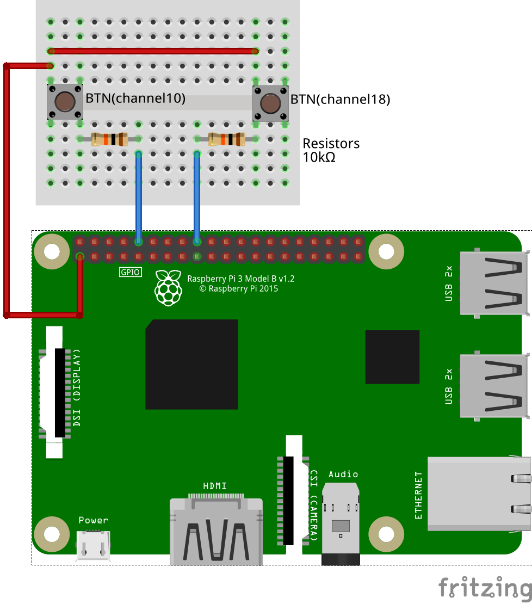

# Button_pi
Simple sample of events from two buttons with Raspberry pi

### Coonection schema



## Getting Started

### Prerequisites

### Installing

## Running

__as app__

```sh
export FLASK_APP=flaskr
flask run
```

__as wsgi server__

```sh
gunicorn --worker-class eventlet -w 1 -b localhost:8080 wsgi
```

## Deployment
As seen above (gunicorn...)

## Authors 

## License

This project is licensed under the MIT License
